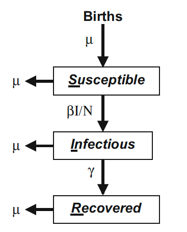

```{r setup, include=FALSE}
knitr::opts_chunk$set(echo = TRUE)
```

# Modelos Epidemiológicos Mecanicistas  

En esta parte del curso vamos a trabajar con modelos construidos a partir del conocimiento de las relaciones entre los elementos que componen un sistema biológico-epidemiológico. El modelo básico que vamos a estudiar se conoce como __SIR__ y se construye mediante la formulación de __ecuaciones diferenciales (ODE)__ que se resuelven utilizando procedimientos de __integración numérica__, ya que se trata de sistemas de __ecuaciones diferenciales no-lineales__, y no poseen soluciones analíticas sencillas.  

## El Modelo SIR  

Kermack and McKendrick (1927) formularon una serie de ecuaciones para entender el funcionamiento de un sistema epidemiológico, para una infección que se extiende y luego disminuye.  En resumen, su planteamiento se puede expresar en un modelo básico a base de un sistema de ecuaciones diferenciales:

  

$$\frac{dS}{dt} = \mu(N - S) - \beta I\frac{S}{N}\qquad(1)$$  
$$\frac{dI}{dt} = \beta I\frac{S}{N} - (\mu + \gamma)I\qquad(2)$$  
$$\frac{dR}{dt} = \gamma I - \mu R\qquad(3)$$  
En las ecuaciones (1) y (2) podemos reemplazar el valor de _N_ con 1, cuando _S, I, y R_ se expresan como fracción de la población total _N_.  

### Algunos supuestos del sistema de ecuaciones anterior:  

* $N$ es el __tamaño poblacional__, con una tasa _per capita_ de mortalidad, $\mu$, en equilibrio con una tasa de natalidad $\mu N$.  
* La __población no cambia en el tiempo__, $dN/dt = 0$ y por lo tanto $N = S + I + R$ es constante.  
* La __mortalidad__ inducida por la infección es 0.    
* __No hay inmunidad perinatal__, los nacimientos pasan a la clase $S$ directamente.  
* La __transmisión__ de infectados a susceptibles está "controloda" por el término $\beta I\frac{S}{N}$.  Esto implica:  
  * los individuos infecciosos, $I$, se __mezclan al azar__ con los otros individuos ($S/N$);  
  * $\beta$ es la __tasa de contactos__ multiplicada por la probabilidad de transmisión al entrar en contacto $I$ con $S$.  
* La probabilidad de __recuperarse o morir__ no cambian durante la infección.  
* La __infectividad__ no cambia durante la infección.  
* los __individuos infectados__ se mueven directamente a la clase $I$.  
* los individuos infectados permanecen así por un __periodo infeccioso__ promedio $1/\gamma$ (se asume que $\mu$ << $\gamma$).  
* el modelo asume que los individuos __recuperados son inmunes__ por el resto de sus vidas.  

## Integración Numérica del Modelo SIR  
Para resolver el sistema de ecuaciones diferenciales e integrar los cambios en función del tiempo, usaremos el paquete __deSolve__ de R.  Vamos a usar un modelo aún más simple, haciendo que $\mu$ sea 0 __(epidemia cerrada)__.  

En primer lugar hay que definir una función en R en la cual están incluidos:  tiempo (cuando hay estacionalidad), vector de la variables de estado ($S, I, R$), los parámetros del modelo ($\beta, \mu, \gamma, N$).  

```{r sirmodbasico}
library(deSolve)
sirmod=function(t, y, parms){
   #Pull state variables from y vector
   S=y[1]
   I=y[2]
   R=y[3]
   #Pull parameter values from parms vector
   beta=parms["beta"]
   mu=parms["mu"]
   gamma=parms["gamma"]
   N=parms["N"]
   #Define equations
   dS = mu * (N  - S)  - beta * S * I / N
   dI = beta * S * I / N - (mu + gamma) * I
   dR = gamma * I - mu * R
   res=c(dS, dI, dR)
   #Return list of gradients
   list(res)
 }
```

Definimos los parámetros, los valores iniciales de las variables de estado y la escala de tiempo y resolución.  La escala de tiempo es de 26 semanas (6 meses) con resolución de 1/10 de semana (10 incrementos por semana). Como vamos a modelar usando la fracción de individuos en cada clase $N$ = 1, no hay nacimientos ni muertes, $\mu$ = 0, un período infeccioso de 2 semanas ($\gamma$ = 1/2), y una tasa de transmisión de 2 ($\beta$ = 2).  Asumimos una fracción de infectados iniciales de 0.1% de la población inicial, y el resto susceptible.  

```{r param}
 times  = seq(0, 26, by=1/10)
 parms  = c(mu = 0.0, N = 1, beta =  2, gamma = 1/2)
 start = c(S=0.999, I=0.001, R = 0)
```  

A continuación se aplica la función __ode__, y los resultados se convierten a un __data.frame__ para usarlos con más facilidad.  

```{r ode}
out = ode(y = start, times = times, func = sirmod, 
     parms = parms)
out=as.data.frame(out)
head(round(out, 3))
```
  
Ahora vamos a construir una gráfica para observar la dinámica del modelo SIR básico.

```{r plotsir}
 plot(x = out$time, y = out$S, ylab = "Fracción de N", 
      xlab = "Semanas", type = "l", lwd = 3, col = "blue")
 lines(x = out$time, y = out$I, lwd = 3, col = "red")
 lines(x = out$time, y = out$R, lwd = 3, col = "green")
 legend(15, 0.7, legend = c("S", "I", "R"), col = c("blue", "red", "green"), lty = 1)
```

### Ejercicio
Examinar los resultados al cambiar los parámetros y valores iniciales y relacionarlos a escenarios epidemiológicos hipotéticos.  

* ¿Cuál es el efecto de disminuir la cantidad inicial de susceptibles, S, y con cuáles escenarios epidemiológicos podemos relacionarlos?  
* Igual con $\beta$ y $\gamma$.

## $R_0$, razón reproductiva básica

Para patógenos que se transmiten directamente, __$R_0$__ es, por definición, el número esperado de casos secundarios que surgen de un caso específico en una población completamente susceptible.  Es una de los valores más importantes en los estudios epidemiológicos, y manejo de enfermedades infecciosas.  Algunas de las inferencias que se obtienen del cálculo de $R_0$:  

* El __umbral__ para el establecimiento de una infección.  Cuando $R_0$ es mayor que 1, un patógeno puede invadir una población; si es menor que 1, se rompe la cadena de infección y esta no procede.  En estudios de poblaciones naturales se define una __densidad crítica del hospedero__.  
* Define el umbral para lograr __inmunidad de manada__ mediante vacunación.  Si hay un número suficiente de inmunizados (no susceptibles) lo que se conoce como __$R_0$ efectivo__, ($R_E = sR_0$, donde _s_ es la proporción de susceptibles en un momento dado), disminuye por debajo de 1.  Este umbral es: 1- 1/$R_0$.  

## Valor teórico de $R_0$  
A partir de la ecuación (2), y asumiendo $\mu$ = 0: 
$$\frac{dI}{dt} = \beta IS - \gamma I$$  
obtenemos:  
$$\frac{dI}{dt} = I(\beta S - \gamma)$$  
Una solución para el caso en que no ocurra epidemia ($dI/dt = 0$) es que:  
$$\beta S - \gamma = 0$$  
y de aquí podemos obtener la fracción de susceptibles necesaria para que ocurra la epidemia (umbral):  
$$S_u = \frac{\gamma}{\beta}$$
A esta razón $\gamma / \beta$ se la conoce como __tasa de remoción relativa__, y tiene que ser 

suficientemente baja para permitir que la enfermedad progrese.  Sin embargo, el valor que más se utiliza en epidemiología es el inverso, y es al que se conoce como:  
$$R_0 = \frac{\beta}{\gamma}$$  

Sabiendo que el R efectivo es $R_E = R_0*s$, podemos encontrar el valor umbral teórico de R para que proceda la infección, reemplazando $R_0$ por $\beta / \gamma$ y _s_ por $S_u$:  
$$R_E = R_0 * S_u = \frac{\beta}{\gamma} * \frac{\gamma}{\beta} = 1$$  

## Análisis de $R_0$  
En la siguiente gráfica podemos observar las variaciones de $R_E$ y el punto en el cual la infección decae al alcanzarse el umbral $S_0$.  

```{r re}
#Calculate R0
R0 = parms["beta"]/(parms["gamma"]+parms["mu"])

#Adjust margins to accommodate a second right axis
par(mar = c(5,5,2,5))
#Plot state variables
plot(x = out$time, y = out$S, ylab = "Fraction",
     xlab = "Time",  type = "l", col = "blue", xlim = c(0, 13))
lines(x = out$time, y = out$I, col = "red")
lines(x = out$time, y = out$R, col = "green")

#Add vertical line at turnover point
xx = out$time[which.max(out$I)]
lines(c(xx,xx), c(1/R0,max(out$I)), lty = 3)
ss = out$S[which.max(out$I)]
lines(c(0,xx), c(ss,ss), lty = 3)

#prepare to superimpose 2nd plot
par(new = TRUE)
#plot effective reproductive ratio (w/o axes)
plot(x = out$time, y = R0*out$S, type = "l", lty = 2,
     lwd = 2, col = "black", axes = FALSE, xlab = NA, 
     ylab = NA, ylim = c(0, 4), xlim = c(0, 13))
lines(c(xx, 26), c(1,1), lty = 3)
#Add right-hand axis for RE
axis(side = 4)
mtext(side = 4, line = 4, expression(R[E]))
#Add legend
legend("right", legend = c("S", "I", "R", 
     expression(R[E])), lty = c(1,1,1, 2),  
     col = c("black", "red", "green", "black"))
```

## Tamaño Final de la Epidemia 

Al final de la epidemia, cuando $I=0$, El valor de R ($R^*$) es el __tamaño final de la epidemia__, $f$, y está dado por: $f \approx exp(-R_0)$.  Se puede obtener un valor más exacto de manera computacional:  
```{r fes, message=FALSE, warning=FALSE}
# usando el paquete rootSolve
require(rootSolve)
parms  = c(mu = 0.0, N = 1, beta =  3.5, gamma = 1/2)
equil=runsteady(y=c(S=1-1E-5, I=1E-5, R=0), 
times=c(0,1E5), func=sirmod, parms=parms)
round(equil$y, 3)
# gráfica de tfe vs R0
#Candidate values for R0 and beta
R0 = seq(0.1, 10, length=100)
betas= R0 * 1/2
#Vector of NAs to be filled with numbers
f = rep(NA, 50)
#Loop over i from 1, 2, ..., 50
for(i in seq(from=1, to=100, by=1)){
     equil=runsteady(y=c(S=1-1E-5, I=1E-5, 
       R=0), times=c(0,1E5), func=sirmod, 
       parms=c(mu=0, N=1, beta=betas[i], gamma=1/2))
     f[i]=equil$y["R"]
}
plot(R0, f, type="l", xlab=expression(R[0]))
curve(1-exp(-x), from=1, to=10, add=TRUE, col="red")
```

## Epidemia abierta  

Vamos a considerar el caso en el que hay reclutamiento de nuevos susceptibles ($\mu > 0$).  En este caso se puede estudiar la dinámica de la epidemia en varias ocurrencias.  
```{r abierta}
times  = seq(0, 52*50, by=.1)
parms  = c(mu = 1/(50*52), N = 1, beta =  2, 
      gamma = 1/2)
start = c(S=0.19, I=0.01, R = 0.8)
out = as.data.frame(ode(y=start, times=times, 
      func=sirmod, parms=parms))
par(mfrow=c(1,1)) #Make room for side-by-side plots 
plot(times, out$I, ylab="Fraction", xlab="Time", 
      type="l")
```

## REFERENCIAS

* __Beckley, R., Weatherspoon, C., Alexander, M., Chandler, M., Johnson, A., Bhatt, G.S.__ n.d. [Modeling epidemics with differential equations](https://simiode.org/resources/3734/download/2013-StudentGroupProjectEpidemics.pdf).  Tennessee State University  

* __Bjørnstad, O.N.__, 2018. Epidemics: Models and Data using R, Use R! Springer International Publishing, Cham. https://doi.org/10.1007/978-3-319-97487-3

* __Keeling, M.J., Rohani, P.__ 2008. Modeling infectious diseases in humans and animals. Princeton University Press, Princeton.

* __Krylova, O., Earn, D.J.D.__ 2013. Effects of the infectious period distribution on predicted transitions in childhood disease dynamics. _J R Soc Interface 10_. https://doi.org/10.1098/rsif.2013.0098

* __Wearing, H.J., Rohani, P., Keeling, M.J.__  2005. Appropriate Models for the Management of Infectious Diseases. _PLoS Med 2_. https://doi.org/10.1371/journal.pmed.0020174

