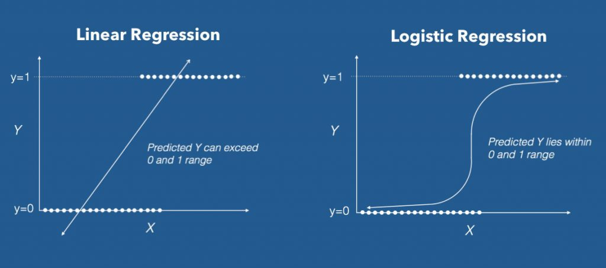

#Regresión Logística

En una __regresión logística__ la variable respuesta (dependiente) es una _variable binaria_ (dicótoma en términos generales), y las variables predictoras (independientes) pueden ser binarias, categóricas o continuas.  

[Logistic Regression vs Linear Regression](https://www.machinelearningplus.com/machine-learning/logistic-regression-tutorial-examples-r/)


Como la variable respuesta solo puede tener valores entre 0 o 1, y las variables independientes pueden ser continuas, con cualquier valor real, para formular un modelo de regresión logística se hace una transformación de probabilidades a 'razones de probabilidades' (en inglés __odd ratios (ORs)__), o proporción de casos favorables a desfavorables.

La transformación tiene esta forma:

$$OR_i = \frac{\pi}{1-\pi} \qquad (1)$$
donde $\pi$ es la probabilidad de que el evento dependiente ($Y$) ocurra; luego se calcula el logaritmo del $OR$, el cual se denomina _logit_:

$$logit(\pi) = log\frac{\pi}{1-\pi} \qquad (2)$$

El modelo para la regresión, con dos variables independientes ($x_1$, $x_2$), es:

$$logit(\pi)=\beta_0 + x_1\beta_1 +x_2\beta_2\qquad (3)$$

##EJEMPLO 1: Predicción de alta presión en mujeres
Vamos a explorar un modelo de diagnóstico de alta presión, a partir de datos de mujeres (n = 189), en relación a su edad, estado de menopausia, y el índice de masa corporal.  Los datos están codificados como variables binarias:

|Variables|Nombre|Código|
|:--------|:-----|:-----:|
|Edad (años)|age|0:≤50, 1>50|
|Alta presión|dxhigh|0:no, 1:sí|
|BMI (kg/m2)|bmi|0:≤25, 1:>25|
|Menopausia|menop|0:pre-, 1:menopausia|

Para este modelo utilizaremos la función __glm__ (general linear model):
```{r logistic}
#leemos los datos:
library(readxl)
hbp <- read_excel("data/mod_empiricos.xlsx", 
                            sheet = "hbp")
```

### Modelo logístico con glm
```{r message=FALSE, warning=FALSE}
#modelo logístico:
highbp <- glm(dxhigh ~ age + bmi + menop, data = hbp,
              family=binomial(logit))
#resumen de los resultados:
summary(highbp)
#obtener los coeficientes como ORs:
exp(cbind(OR = coef(highbp), confint(highbp)))
```


## EJEMPLO 2: Variables predictoras de diabetes tipo 2, en una población de nativos Pima
En este caso las variables independientes no son binarias (0,1) sino datos continuos.  No se calculan los $OR$ (ni _logit_), y el resultado son sólo los coeficientes de la regresión.

### Datos
```{r message=FALSE}
# paquetes
library(tidyverse)
library(caret)
library(mlbench)
# cargar datos (estos son directamente del paquete mlbench, en su caso debe usar readxl o similar)
data("PimaIndiansDiabetes2", package = "mlbench")
# inspeccionar los datos
sample_n(PimaIndiansDiabetes2, 6)
```
### Dividiendo los datos en "training" y "test"
```{r}
# Split the data into training and test set
set.seed(123)
training.samples <- PimaIndiansDiabetes2$diabetes %>% 
  createDataPartition(p = 0.8, list = FALSE)
train.data  <- PimaIndiansDiabetes2[training.samples, ]
test.data <- PimaIndiansDiabetes2[-training.samples, ]
```

### Modelo usando glm
```{r message=FALSE, warning=FALSE}
library(MASS)
# Fit the model
model <- glm(diabetes ~., data = train.data, family = binomial)
# Summarize the final selected model
summary(model)
```
#### Gráfica logística diabetes vs glucosa
```{r message=FALSE, warning=FALSE}
library(ggplot2)
#pasar datos de diabetes "pos" y "neg" a 1s y 0s
diabetes01 <- ifelse(PimaIndiansDiabetes2$diabetes == "pos", 1, 0)
#gráfica con curva logística
ggplot(PimaIndiansDiabetes2, aes(x=glucose, y=diabetes01, na.rm = TRUE)) +
  geom_point() +
  geom_smooth(method = "glm", 
    method.args = list(family = "binomial"), 
    se = FALSE)
```


### Predicciones usando el 20% de los datos
```{r}
# Make predictions
probabilities <- model %>% predict(test.data, type = "response")
predicted.classes <- ifelse(probabilities > 0.5, "pos", "neg")
# Prediction accuracy
observed.classes <- test.data$diabetes
mean(predicted.classes == observed.classes, na.rm = TRUE)
```


