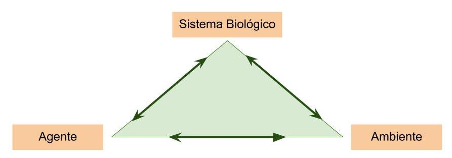

#Epidemiología

* _epi_ (sobre) _demos_ (pueblo) y _logos_ (ciencia)
* usaremos definición amplia
* triángulo de causalidad epidemiológica; originalmente para infecciones, pero lo vamos a utilizar de manera más general:
```{r image1, echo=FALSE, fig.cap="Triada Epidemiológica", out.width='100%'}

```
***

#Modelos
MODELOS:

* modelos conceptuales (teóricos)
* modelos matemáticos  
> modelos computacionales

* modelos empíricos (datos, estadísticos)
* modelos mecanísticos (dinámicos, compartimentos)

* modelos determinísticos (ecuaciones diferenciales)
* modelos estocásticos (probabilísticos, matrices)
* modelos basados en agentes

USOS:

* análisis: comparación, verificación, prueba de hipótesis
* simulación: proyecciones, validación, generación de hipótesis

***

#Estudios Epidemiológicos

* __Epidemiología descriptiva__: descripción del sistema epidemiológico (tiempo, lugar, individuos, incidencia, prevalencia, mortalidad, et c.), para luego formular hipótesis.
* __Epidemiología analítica__: busca establecer posibles relaciones causales entre factores a los que se exponen personas y poblaciones y las condiciones que presentan. Incluye la determinación de _factores de riesgo_.
* __Epidemiología experimental__: utiliza la metodología científica experimental, para la prueba de hipótesis sobre causas y control de condiciones.  Incluye las pruebas clínicas de nuevos procedimientos y compuestos.
* __Eco-epidemiología__: busca, mediante herramientas ecológicas, estudiar integralmente como interaccionan los factores ambientales con las personas y poblaciones en los medios que los rodean y como ello puede influir en la evolución de enfermedades que se producen como consecuencia de dicha interacción.
[Estudio de John Snow en la epidemia de cólera en Londres, 1854](https://en.wikipedia.org/wiki/1854_Broad_Street_cholera_outbreak)

```{r image2,echo=FALSE,fig.cap="Cólera en Londres",out.width='60%'}
knitr::include_graphics("media/londoncholera.jpg")
```


***
#Asuntos críticos en la investigación epidemiológica

###__"Causation" (Causalidad)__: 
####Criterios: 

* asociación (exposición - respuesta)   
* gradiente (dosis - respuesta)  
* secuencia temporal (agente -> respuesta)  
* coherencia teórica (biología)  
* especificidad en la asociación  
* analogía de efectos con otros agentes similares  

***

###__"Confounding effect or variable" (efecto o variable de confusión)__:

* ejemplo: consumo de alcohol >> infarto al miocardio

* regresión múltiple, análisis de covarianza, regresión logística


***

#Glosario

* __Incidencia__ es el número de casos nuevos de un evento de salud (como el desarrollo de una enfermedad o la reacción a un medicamento) que se producen durante un periodo específico, normalmente un año, en una población dada. Por tanto, la incidencia es también una medida del riesgo de experimentar el evento de salud durante cierto periodo.  
* __Morbilidad__ se refiere a la incidencia de enfermedades en la población e incluye tanto enfermedades mortales como no mortales. La estadísticas de la morbilidad definen la salud pública de una población con mayor precisión que las de mortalidad, porque muchas enfermedades tienen una mortalidad relativamente baja.
* __Mortalidad__ es la incidencia de muerte en la población. Las enfermedades infecciosas fueron la principal causa de la muerte en 1900 en los países desarrollados, pero ahora son mucho menos significativas. Ahora las enfermedades no infecciosas, asociadas al estilo de vida, como las enfermedades cardíacas y el cáncer, son mucho más prevalentes y causan mayor mortalidad que las enfermedades infecciosas.
* __Prevalencia__ es la proporción de una población que tiene una condición (normalmente una enfermedad o un factor de riesgo, como fumar).  

